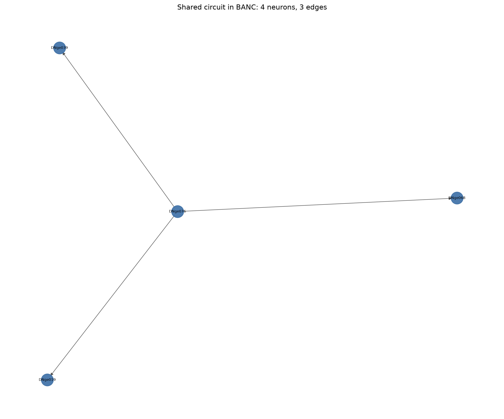
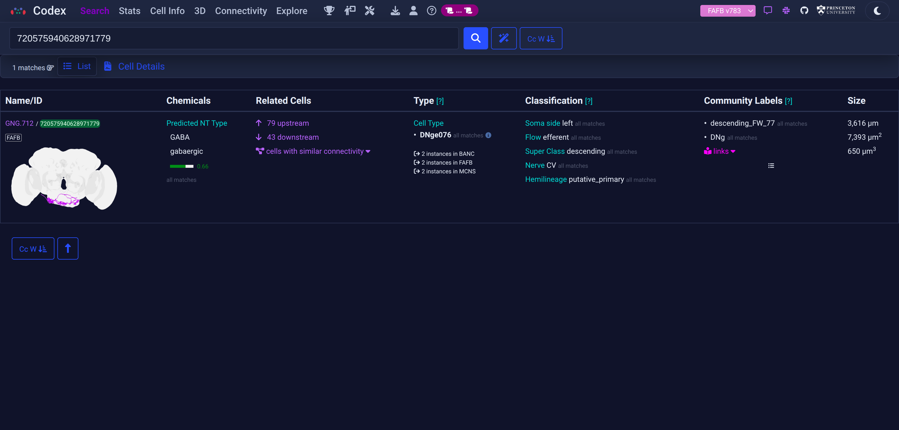
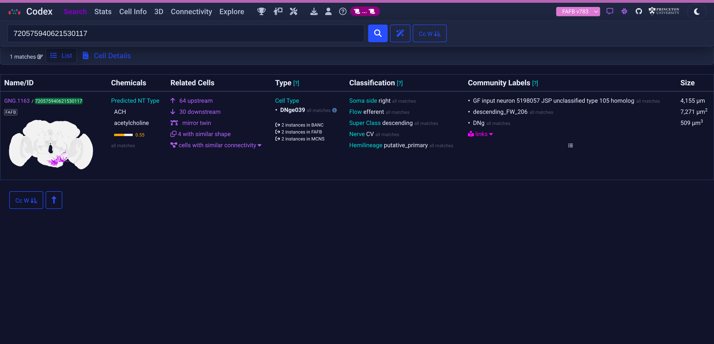
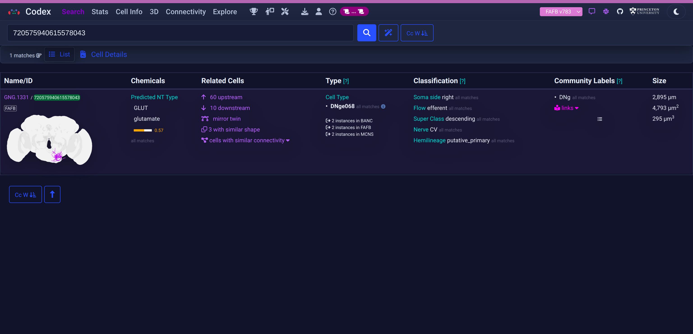
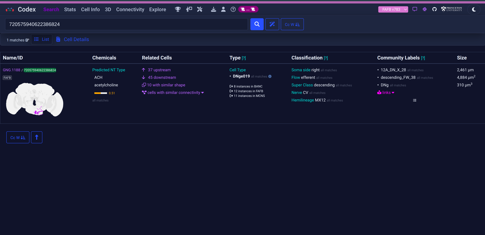

# A conserved descending-neuron output motif across three *Drosophila* connectomes

**Dataset analysed:** FAFB (full adult female brain, FlyWire v783)
**Author:** Athmeeya M Kashyap, IIIT Hyderabad

## The circuit

The shared circuit is a four-neuron motif of **descending neurons** in which one GABAergic neuron drives three other descending neurons. The same directed induced subgraph appears, edge for edge, in BANC, FAFB, and MANC.

```
                ┌──▶ DNge039   acetylcholine
   DNge076 ─────┼──▶ DNge068   glutamate
    (GABA)      └──▶ DNge019   acetylcholine
```

| Cell type | Neurotransmitter | NT source | FAFB root id (v783) |
| --- | --- | --- | --- |
| DNge076 | GABA | predicted† | 720575940628971779 |
| DNge039 | acetylcholine | predicted† | 720575940621530117 |
| DNge068 | glutamate | predicted† | 720575940615578043 |
| DNge019 | acetylcholine | predicted† | 720575940622386824 |

† All four neurotransmitter identities come from the `neurotransmitter_predicted` field in the BANC Codex annotation table (materialization v626). No verified curations (`neurotransmitter_verified`) were recorded for these neurons. Predictions are CNN-based calls from Eckstein et al. 2024.

Directed edges (present in all three datasets): DNge076 to DNge039, DNge076 to DNge068, DNge076 to DNge019. The in/out degree sequence `[(0,3), (1,0), (1,0), (1,0)]` is identical in BANC, FAFB, and MANC, confirming the induced subgraphs are isomorphic.

## Figures

**Network graph.** The four neurons and three directed edges, labelled by cell type (generated by `python -m flywire solve`):



**Codex 3D meshes.** Each neuron as a reconstructed 3D mesh on Codex (FAFB v783), with its Codex cell-info panel showing cell type and neurotransmitter.

| DNge076 (GABA, hub) | DNge039 (acetylcholine) |
| --- | --- |
|  |  |
| **DNge068 (glutamate)** | **DNge019 (acetylcholine)** |
|  |  |

## Observations

1. **All four neurons are descending neurons.** The "DN" prefix in the FlyWire cell type name denotes descending neurons per the published FlyWire nomenclature (Schlegel et al. 2024). Descending neurons are the principal channel carrying signals from the brain to the ventral nerve cord: their cell bodies and dendrites sit in the brain and their axons travel through the neck connective to recruit motor circuits. A motif built entirely from descending neurons is therefore a premotor command pathway rather than a sensory or local circuit.

2. **The motif is a one-to-three divergent hub.** A single presynaptic neuron, DNge076, contacts three other descending neurons and receives no input from within the set. This fan-out is consistent with a coordinating or gating role, where one descending pathway sets the state of several others at once.

3. **The hub neurotransmitter is predicted GABA; the targets are predicted cholinergic and glutamatergic.** DNge076's GABA identity is a CNN prediction (Eckstein et al. 2024), not a manually verified curation. If correct, its action on the three targets is most likely inhibitory or modulatory. The targets' identities are likewise predicted: acetylcholine (DNge039, DNge019, excitatory) and glutamate (DNge068, commonly inhibitory at *Drosophila* synapses via GluClα). The inhibitory-hub interpretation in the hypothesis below is contingent on the GABA prediction being correct; the structural finding (a 1-to-3 divergent motif conserved across three connectomes) holds regardless of neurotransmitter identity.

4. **Conservation across sex and body region is the strongest signal.** The motif is identical in a female brain (FAFB), a female brain-and-nerve-cord (BANC), and a male nerve cord (MANC). Reproducibility across two individuals, both sexes, and independent reconstruction pipelines argues that the connection pattern is a stereotyped feature of the species, not reconstruction noise or individual variation.

## Interpretation and hypothesis

Descending neurons are comparatively few (on the order of a few hundred per hemisphere) and several are known command-like neurons for behaviours such as walking, escape, and grooming (Namiki et al., 2018; Cheong et al., 2024). Braun et al. (2024) show that descending control is not carried by single command lines but is distributed across interconnected DN populations, with one DN recruiting others through direct excitatory connections to shape motor output. That work establishes DN-to-DN connectivity as a real and functionally important organisational principle. The circuit found here is a distinct, inhibitory variant of that architecture: rather than excitatory recruitment, the conserved motif is a GABAergic hub diverging onto three other DNs, suggesting the DN-to-DN network includes both excitatory broadcasting (Braun et al.) and inhibitory coordination (this circuit). If the GABA prediction is correct, DNge076 could enforce winner-take-all selection among descending commands or gate the simultaneous activity of its targets during a specific behavioural state.

**Hypothesis:** DNge076 acts as an inhibitory coordinator that suppresses or co-regulates the three downstream descending pathways, so that their motor effects are mutually exclusive or jointly gated. This predicts that silencing DNge076 should disinhibit the three targets and produce co-activation of the movements they drive, while activating DNge076 should suppress them. The prediction is testable with the matched neurons identified here, since the same four cells are now localised in all three connectomes.

## Why these matches are trustworthy

The neurons were not matched by name or by guesswork. The correspondence uses FlyWire Codex's curated cross-dataset match identifiers (`fafb_783_match_id`, `manc_121_match_id`) stored against the BANC reconstruction, which are neuron-level homology assignments versioned to the exact FAFB v783 and MANC v1.2.1 releases used here. Only strict one-to-one matches were kept. The reproduction steps and the full method are in `README.md`.

## References

1. Dorkenwald, S., et al. (2024). *Neuronal wiring diagram of an adult brain.* Nature 634, 124-138. (FAFB FlyWire connectome.)
2. Schlegel, P., et al. (2024). *Whole-brain annotation and multi-connectome cell typing of Drosophila.* Nature 634, 139-152. (FlyWire cell typing and cross-matching.)
3. Takemura, S., et al. (2024). *A connectome of the male Drosophila ventral nerve cord.* eLife 13:RP97769.
4. Namiki, S., Dickinson, M. H., Wong, A. M., Korff, W., Card, G. M. (2018). *The functional organization of descending sensory-motor pathways in Drosophila.* eLife 7, e34272.
5. Cheong, H. S. J., et al. (2024). *Transforming descending input into behavior: The organization of premotor circuits in the Drosophila male adult nerve cord.* eLife 13:RP96084.
6. Braun, J., Hurtak, F., Wang-Chen, S., Ramdya, P. (2024). *Descending networks transform command signals into population motor control.* Nature. https://doi.org/10.1038/s41586-024-07523-9. (Shows that descending control is distributed across interconnected DN populations rather than carried by single command neurons — establishes DN-to-DN connectivity as a documented organisational principle.)
7. Eckstein, N., et al. (2024). *Neurotransmitter classification from electron microscopy images at synaptic sites in Drosophila melanogaster.* Cell 187, 2574-2594. (Neurotransmitter predictions.)
8. FlyWire Codex, https://codex.flywire.ai (cell types, neurotransmitters, 3D meshes, cross-dataset match identifiers).
